# Agentic Agent Garage

**Your engineering team has AI assistants. Now give AI to your entire SDLC.**

Most teams use AI for isolated tasks — a code completion here, a ticket summary there. The **Agentic Agent Garage** is something different: a coordinated fleet of **69 specialized AI agents across 17 SDLC phases**, orchestrated end-to-end from the first business idea to post-production incident response.

A central **SDLC Supervisor** receives any request and routes it to the right phase agent automatically — no configuration, no switching between tools. Each phase agent breaks the work down into focused sub-agents and atomic skills, connected to your existing toolchain via **20+ MCP integrations**: Jira, GitHub, SonarQube, ArgoCD, PagerDuty, and more.

**Two ways to use it:**

- 💬 **Chat-driven** via Open WebUI — talk to the SDLC Supervisor or any phase agent directly; it handles the orchestration for you
- ⚡ **As a Claude Code marketplace** — install SDLC phase plugins and use 180 atomic skills as slash commands directly in your IDE: `/fix-bug`, `/generate-test-suite`, `/deployment-plan`

Self-hosted. Open source. Docker-deployable in minutes. Built on n8n, Ollama, and Open WebUI — with enterprise-ready patterns proven in production at scale.

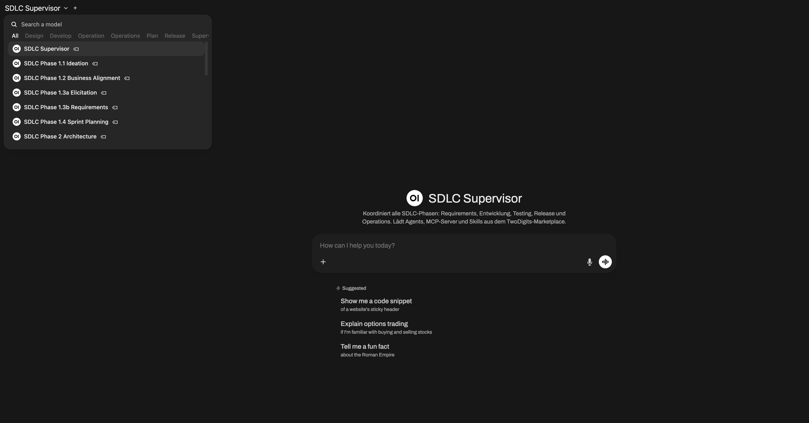

> This project builds upon the foundation of the **Self-hosted AI Starter Kit**, curated by <https://github.com/n8n-io>, which combines the self-hosted n8n platform with a curated list of compatible AI products and components.

---

## ⚠️ Disclaimer

Just to reiterate the point from the license:
This project is provided on an "AS IS" BASIS, WITHOUT WARRANTIES OR CONDITIONS OF ANY KIND, either express or implied.

This project is provided as a **proof of concept** and is intended for **experimental
or educational purposes only**. It's maintained on best-effort basis. While it's
perfectly possible to use it as a base for an enterprise implementation, the project
"as is" is **not** suitable for production or mission-critical use. The maintainers do
not guarantee that the software functions as intended, nor do they assume responsibility
for any loss or damage resulting from its use.

Use of this project does not imply any affiliation with or endorsement by Accenture.

> [!NOTE]
> **Enterprise Version Available:** While this is a showcase lab environment, an enterprise implementation version has been successfully deployed with one of our clients and has been in production for years. This demonstrates that the concepts behind this solution are enterprise-ready.

---

## Table of Contents

- [Key Features](#key-features)
- [The SDLC Plugin System](#the-sdlc-plugin-system)
  - [Architecture: Three Tiers](#architecture-three-tiers)
  - [The SDLC Supervisor](#the-sdlc-supervisor)
  - [SDLC Phases at a Glance](#sdlc-phases-at-a-glance)
  - [Complete Plugins](#complete-plugins)
  - [MCP Connectors](#mcp-connectors)
  - [Automation Hooks](#automation-hooks)
  - [End-to-End Example Pipeline](#end-to-end-example-pipeline)
- [Tech Stack](#tech-stack)
- [Installation](#installation)
- [Getting Started](#-getting-started)
- [OpenWebUI and n8n Integration Architecture](#-openwebui-and-n8n-integration-architecture)
- [Chat-based Workflow Creation with n8n-MCP](#-chat-based-workflow-creation-with-n8n-mcp)
- [Upgrading](#upgrading)
- [Recommended Reading](#-recommended-reading)
- [Video Walkthrough](#-video-walkthrough)
- [More AI Templates](#️-more-ai-templates)
- [Tips & Tricks](#-tips--tricks)
- [License](#-license)

---

## Key Features

🔁 **Full SDLC Coverage:** 69 AI agents across 17 phase modules — from Ideation and Sprint Planning through Development, Testing, Release, and all the way to Incident Response and Compliance.

🎛️ **SDLC Supervisor:** A single entry point that automatically routes any request to the right phase agent. No need to know which agent handles what — just describe the task.

🧠 **Three-Tier Architecture:** Every phase follows the same pattern — Orchestrators (phase entry), Agents (workflow execution), Skills (atomic operations). Pick the level of abstraction that fits your task.

🛍️ **Claude Code Marketplace:** SDLC phase plugins are installable as Claude Code skill packages. 180 slash-command skills available directly in your IDE — `/fix-bug`, `/generate-tests`, `/rollback-plan`, and more.

🔌 **20+ MCP Connectors:** Deep, bidirectional integrations with your enterprise toolchain — Jira, GitHub, SonarQube, ArgoCD, PagerDuty, Prometheus, and more. Agents read from and write to your existing systems.

🪝 **Automation Hooks:** Pre-commit quality gates, pre-push test runs, and post-deploy smoke tests that trigger automatically as part of your normal Git workflow.

🌐 **Open Source & Self-Hosted:** 100% open-source toolchain (n8n, Open WebUI, Ollama), deployable via Docker Compose, and ready for enterprise adaptation.

---

## The SDLC Plugin System

The heart of the Agentic Agent Garage is the **SDLC Plugin System** — a collection of 17 phase modules covering the complete software development lifecycle, organized in a three-tier architecture of Orchestrators, Agents, and Skills.

### Architecture: Three Tiers

Every SDLC phase follows the same hierarchical structure:

```
Orchestrator
└── Agents
      └── Skills
```

| Tier             | What it does                                                                                                                                         | When to use it                                                                   |
| ---------------- | ---------------------------------------------------------------------------------------------------------------------------------------------------- | -------------------------------------------------------------------------------- |
| **Orchestrator** | Entry point for a full phase. Conducts a dialogue with the user, clarifies context, and delegates to the right agent. Does not execute tasks itself. | When you want to work through a full phase and let the system decide what to do. |
| **Agent**        | Specialized workflow for a concrete task type within a phase. Combines multiple skills into a coherent flow and makes its own decisions.             | When you know the type of task but want the agent to handle the steps.           |
| **Skill**        | An atomic single capability — exactly one thing, with a defined input and output. Callable directly as a slash command.                              | When you know exactly what you need — fast, direct, no overhead.                 |

**Example — Phase 3.1 Development:**

```
/development-orchestrator                    ← Orchestrator
├── /development-code-generator-agent        ← Agent
│     ├── /development-code-from-requirements
│     ├── /development-generate-tests
│     └── /development-generate-docs
├── /development-code-reviewer-agent         ← Agent
│     ├── /development-review-pr
│     ├── /development-security-scan
│     └── /development-code-quality
├── /development-code-transformer-agent      ← Agent
│     ├── /development-refactor
│     ├── /development-migrate-code
│     └── /development-optimize-performance
└── /development-code-dev-assistant-agent    ← Agent
      ├── /development-debug-assist
      ├── /development-fix-bug
      └── /development-pair-program
```

Each phase folder follows the same file structure:

```
sdlc-plugins/{phase}/
├── orchestrator.md               ← Orchestrator definition
├── agents/
│   └── agent-*.md                ← Agent definitions
├── skills/
│   └── {skill-name}/SKILL.md     ← Skill definitions
├── commands/
│   └── {phase}-{skill}.md        ← Slash command wrappers
└── marketplace-metadata.json
```

---

### The SDLC Supervisor

The **SDLC Supervisor** is the central intelligence layer that ties all phase agents together. It receives any user request, determines which SDLC phase is relevant, and routes the request to the appropriate Phase Orchestrator — automatically.

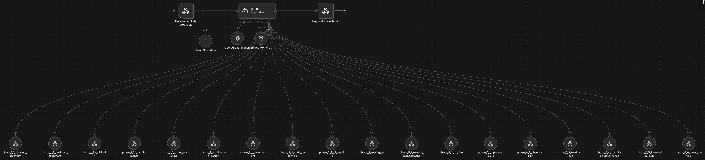

In **Open WebUI**, the SDLC Supervisor appears as the top-level model. Users can either start there for fully automatic routing, or address a specific phase model directly.

In **n8n**, the Supervisor is the master workflow that fans out to all 17+ Phase Orchestrator Agent workflows. Each Phase Orchestrator can also be triggered directly via webhook — bypassing the Supervisor when a specific phase is known.

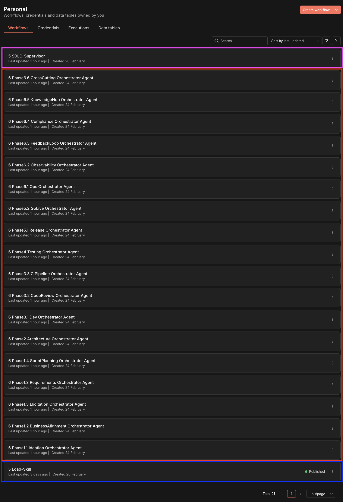

---

### SDLC Phases at a Glance

The system covers **17 phase modules** across 6 classic SDLC stages, with **69 agents** and **180 skills**:

| Phase                  | Module                       | Plugin                   | Agents | Skills | MCP Connectors                  |
| ---------------------- | ---------------------------- | ------------------------ | ------ | ------ | ------------------------------- |
| **1 — Planning**       | 1.1 Ideation & Discovery     | `idea-scout`             | 4      | 8      | —                               |
|                        | 1.2 Business Alignment       | `strategy-navigator`     | 4      | 8      | Jira, Confluence                |
|                        | 1.3 Requirements Engineering | `requirements-engineer`  | 4      | 16     | Jira, Confluence                |
|                        | 1.4 Sprint Planning          | `sprint-architect`       | 4      | 8      | Jira, GitHub                    |
| **2 — Design**         | 2 Architecture & Design      | `solution-architect`     | 4      | 10     | Confluence                      |
| **3 — Implementation** | 3.1 Development              | `code-companion`         | 4      | 17     | SonarQube, Snyk                 |
|                        | 3.2 Code Review & QA         | `review-guardian`        | 4      | 8      | GitHub, SonarQube               |
|                        | 3.3 CI Pipeline              | `pipeline-engineer`      | 4      | 8      | GitHub Actions, Terraform       |
| **4 — Testing**        | 4 Testing & QA               | `test-commander`         | 5      | 19     | TestRail, Codecov, k6           |
| **5 — Deployment**     | 5.1 Release Management       | `release-pilot`          | 4      | 15     | GitHub, ArgoCD, Kubernetes      |
|                        | 5.2 Go-Live                  | `launch-commander`       | 4      | 8      | Slack, LaunchDarkly, PagerDuty  |
| **6 — Operations**     | 6.1 Operations & SRE         | `ops-intelligence`       | 4      | 13     | Prometheus, ELK, PagerDuty      |
|                        | 6.2 Observability            | `observability-sentinel` | 4      | 8      | Grafana, Elasticsearch, Datadog |
|                        | 6.3 Feedback Loop            | `insight-collector`      | 4      | 8      | Amplitude, Intercom, Optimizely |
|                        | 6.4 Compliance & Governance  | `compliance-officer`     | 4      | 8      | Vault, ServiceNow, Confluence   |
|                        | 6.5 Knowledge Hub            | `knowledge-curator`      | 4      | 8      | Confluence, GitHub              |
|                        | 6.6 Cross-Cutting            | `platform-guardian`      | 4      | 8      | GitHub, Jira, Confluence        |

**Totals: 69 Agents · 180 Skills · 20+ MCP Connectors**

In Open WebUI, each phase module is exposed as a dedicated model, giving users a direct, phase-specific entry point:

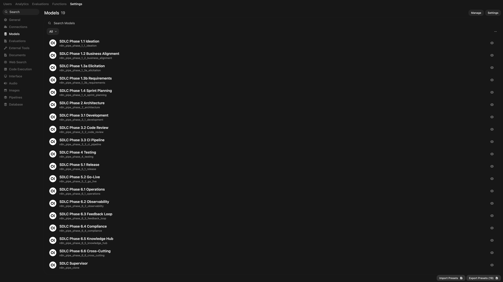

Each model is backed by a dedicated n8n Orchestrator Agent workflow — 21 workflows in total:

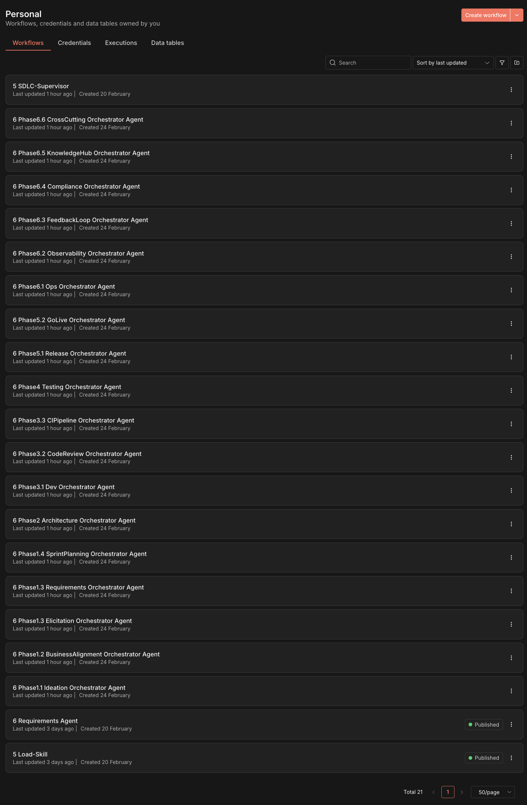

---

### Complete Plugins

All 17 phase modules are packaged as installable marketplace plugins with orchestrator, agent, and skill definitions, marketplace metadata, and MCP configuration. The following five are fully implemented end-to-end — the remaining 12 follow the same structure and are progressively reaching the same level of completion.

#### `requirements-engineer` — Phase 1.3 Requirements Engineering

Transforms vague inputs into structured, traceable requirements.

| Agent               | Role                                                                   |
| ------------------- | ---------------------------------------------------------------------- |
| `agent-elicitation` | Extracts requirements from Jira, Confluence, and local documents       |
| `agent-validator`   | Classifies, prioritizes, and detects conflicts                         |
| `agent-analyzer`    | Traceability matrix, gap analysis, impact reports against the codebase |
| `agent-transformer` | Requirements → User Stories, SRS documents, Mermaid diagrams           |

**16 Skills:** `classify-requirements` · `detect-conflicts` · `elicit-requirements` · `extract-requirements` · `gap-analysis` · `generate-requirements-document` · `generate-user-stories` · `predict-change-impact` · `prioritize-requirements` · `prototype-from-requirements` · `simulate-stakeholder` · `stakeholder-sentiment` · `trace-requirements` · `validate-requirements` · `visualize-requirements` · `voc-analysis`

**MCP:** Jira · Confluence

---

#### `code-companion` — Phase 3.1 Development

Covers the full inner development loop — from writing code to reviewing it.

| Agent                 | Role                                                               |
| --------------------- | ------------------------------------------------------------------ |
| `agent-dev-assistant` | Debugging, bug fixing, pair programming, codebase explanation      |
| `agent-generator`     | Generates code, tests, docs, and CI/CD pipelines from requirements |
| `agent-reviewer`      | Read-only code quality and security review via SonarQube and Snyk  |
| `agent-transformer`   | Refactoring, performance optimization, code migration              |

**17 Skills:** `code-from-requirements` · `code-quality` · `debug-assist` · `explain-codebase` · `fix-bug` · `generate-docs` · `generate-pipeline` · `generate-tests` · `migrate-code` · `optimize-performance` · `pair-program` · `refactor` · `review-pr` · `review-suggest` · `scaffold` · `security-scan` · `translate-code`

**MCP:** SonarQube · Snyk | **Hook:** `pre-commit-quality`

---

#### `test-commander` — Phase 4 Testing & QA

Covers the full test lifecycle — from strategy to specialized execution.

| Agent               | Role                                                              |
| ------------------- | ----------------------------------------------------------------- |
| `agent-planning`    | Test strategy, risk-based testing, test impact analysis           |
| `agent-generation`  | Unit, Integration, E2E, API, and Contract test generation         |
| `agent-execution`   | Test runs, result analysis, coverage reports, performance testing |
| `agent-quality`     | Flaky test fixes, mutation testing, self-healing tests            |
| `agent-specialized` | Visual regression, WCAG accessibility, DAST security testing      |

**19 Skills:** `test-strategy` · `generate-test-plan` · `risk-based-testing` · `test-impact-analysis` · `generate-test-suite` · `generate-api-tests` · `generate-e2e-tests` · `test-data-generator` · `contract-test` · `run-tests` · `analyze-test-results` · `coverage-analysis` · `performance-test` · `fix-flaky-tests` · `mutation-test` · `self-heal-tests` · `visual-regression-test` · `accessibility-test` · `security-test`

**MCP:** TestRail · Codecov · k6 · Playwright | **Hook:** `pre-push-test`

---

#### `release-pilot` — Phase 5.1 Release Management

Orchestrates the full release process from preparation to stakeholder communication.

| Agent                 | Role                                                                    |
| --------------------- | ----------------------------------------------------------------------- |
| `agent-preparation`   | CHANGELOG, Release Notes, SemVer versioning, risk assessment            |
| `agent-product`       | Feature prioritization, OKR management, roadmap generation              |
| `agent-deployment`    | Deployment plans, rollback strategies, Blue-Green/Canary, Feature Flags |
| `agent-communication` | Stakeholder updates, GTM checklists, post-release reports               |

**15 Skills:** `changelog` · `release-notes` · `version-bump` · `release-risk-assessment` · `prioritize-features` · `generate-roadmap` · `okr-management` · `lifecycle-assessment` · `deployment-plan` · `rollback-plan` · `deployment-strategy` · `feature-flag-strategy` · `stakeholder-update` · `gtm-checklist` · `post-release-report`

**MCP:** GitHub Releases · ArgoCD · Kubernetes · LaunchDarkly | **Hook:** `post-deploy-smoke-test`

---

#### `ops-intelligence` — Phase 6.1 Operations & SRE

Full ITIL-aligned incident management and proactive reliability engineering.

| Agent                | Role                                                                  |
| -------------------- | --------------------------------------------------------------------- |
| `agent-incident`     | ITIL incident response: Detect → Triage → RCA → Resolve → Post-Mortem |
| `agent-monitoring`   | Anomaly detection, event correlation, auto-remediation                |
| `agent-optimization` | Trend analysis, capacity forecasting, ITIL CSI improvement plans      |
| `agent-reliability`  | SLA/SLO tracking, error budget management, change impact assessment   |

**13 Skills:** `classify-incident` · `root-cause-analysis` · `resolve-suggest` · `incident-summary` · `anomaly-detection` · `event-correlate` · `auto-remediate` · `analyze-trends` · `capacity-forecast` · `improvement-plan` · `sla-assessment` · `slo-management` · `change-impact-ops`

**MCP:** Prometheus · ELK · PagerDuty

---

### MCP Connectors

The Agentic Agent Garage integrates with your existing enterprise toolchain through **20+ MCP connectors**:

| Category                       | Tools                                              |
| ------------------------------ | -------------------------------------------------- |
| **Project Management**         | Jira · Confluence · ServiceNow                     |
| **Source Control & CI/CD**     | GitHub · GitHub Actions · Terraform · ArgoCD       |
| **Code Quality & Security**    | SonarQube · Snyk · HashiCorp Vault                 |
| **Testing**                    | TestRail · Codecov · k6 · Playwright               |
| **Deployment**                 | Kubernetes · LaunchDarkly                          |
| **Communication**              | Slack · PagerDuty                                  |
| **Monitoring & Observability** | Prometheus · Grafana · ELK/Elasticsearch · Datadog |
| **Product Analytics**          | Amplitude · Intercom · Optimizely                  |

---

### Automation Hooks

Three lifecycle hooks trigger automatically at key development events:

| Hook                     | Event       | Action                             |
| ------------------------ | ----------- | ---------------------------------- |
| `pre-commit-quality`     | Pre-Commit  | Code quality check + security scan |
| `pre-push-test`          | Pre-Push    | Full test suite execution          |
| `post-deploy-smoke-test` | Post-Deploy | Smoke tests after every deployment |

---

### End-to-End Example Pipeline

The following shows a complete SDLC run using the Agentic Agent Garage, from first idea to production feedback:

```
1.  /elicit-requirements + /generate-user-stories     → Phase 1.3
2.  API Design + ADR generation                        → Phase 2
3.  /code-from-requirements + /generate-pipeline       → Phase 3.1
4.  /generate-test-suite + /run-tests                  → Phase 4
5.  /changelog + /deployment-plan                      → Phase 5.1
6.  /rollout-manager with Feature Flags                → Phase 5.2
7.  /anomaly-detection + /slo-management               → Phase 6.1
8.  /adoption-tracker + /feedback-analyst              → Phase 6.3
```

At each step, the corresponding phase agent connects to the relevant MCP tools — automatically pushing requirements to Jira, creating PRs on GitHub, publishing ADRs to Confluence, triggering CI/CD pipelines, and feeding SLO data back from Prometheus.

---

## Tech Stack

✅ [**Open WebUI**](https://openwebui.com/) - User-friendly AI interface

✅ [**Self-hosted n8n**](https://n8n.io/) - Low-code platform with over 400 integrations and advanced AI components

✅ [**Ollama**](https://ollama.com/) - Cross-platform LLM platform to install and run the latest local LLMs

✅ [**Qdrant**](https://qdrant.tech/) - Open-source, high-performance vector store with a comprehensive API

✅ [**PostgreSQL**](https://www.postgresql.org/) - Reliable database system that handles large amounts of data safely

---

## Installation

### Cloning the Repository

```bash
git clone https://github.com/twodigits/agent-garage.git
cd agent-garage
```

### Running the Multi-Container System

A container engine is required to run this multi-container system. Either Docker or Podman can be used. One of these must be selected prior to installation, as it serves as the foundational component for hosting the containers.

### Using Docker Compose

#### For Nvidia GPU Users

```bash
git clone https://github.com/twodigits/agent-garage.git
cd agent-garage
docker compose --profile gpu-nvidia up
```

> [!NOTE]
> If you have not used your Nvidia GPU with Docker before, please follow the
> [Ollama Docker instructions](https://github.com/ollama/ollama/blob/main/docs/docker.md).

#### For AMD GPU Users on Linux

```bash
git clone https://github.com/twodigits/agent-garage.git
cd agent-garage
docker compose --profile gpu-amd up
```

#### For Mac / Apple Silicon Users

If you're using a Mac with an M1 or newer processor, you can't expose your GPU
to the Docker instance, unfortunately. There are two options in this case:

1. Run the starter kit fully on CPU, like in the section "For everyone else"
   below
2. Run Ollama on your Mac for faster inference, and connect to that from the
   n8n instance

If you want to run Ollama on your Mac, check the
[Ollama homepage](https://ollama.com/)
for installation instructions, and run the starter kit as follows:

```bash
git clone https://github.com/twodigits/agent-garage.git
cd agent-garage
docker compose up
```

##### For Mac Users Running Ollama Locally

If you're running Ollama locally on your Mac (not in Docker), you need to modify the OLLAMA_HOST environment variable
in the n8n service configuration. Update the x-n8n section in your Docker Compose file as follows:

```yaml
x-n8n: &service-n8n # ... other configurations ...
  environment:
    # ... other environment variables ...
    - OLLAMA_HOST=host.docker.internal:11434
```

Additionally, after you see "Editor is now accessible via: <http://localhost:5678/>":

1. Head to <http://localhost:5678/home/credentials>
2. Click on "Local Ollama service"
3. Change the base URL to "http://host.docker.internal:11434/"

#### For Everyone Else (CPU Only)

```bash
git clone https://github.com/twodigits/agent-garage.git
cd agent-garage
docker compose --profile cpu up
```

### Using Podman

#### For Nvidia GPU Users

```bash
podman compose --profile gpu-nvidia --file docker-compose.yml up
```

#### For AMD GPU Users on Linux

```bash
podman compose --profile gpu-amd --file docker-compose.yml up
```

#### For Mac / Apple Silicon Users

If you're using a Mac with an M1 or newer processor, you can't expose your GPU
to the Docker instance, unfortunately. There are two options in this case:

1. Run the multi-container system fully on CPU, like in the section "For Everyone Else (CPU Only)"
   below
2. Run Ollama on your Mac for faster inference, and connect to that from the
   n8n instance

```bash
podman compose --file docker-compose.yml up
```

#### For Everyone Else (CPU Only)

```bash
podman compose --profile cpu --file docker-compose.yml up
```

---

## 🚀 Getting Started

### n8n

1. Navigate to http://localhost:5678
2. The Registration form will appear.
3. Enter the requested data. However, these do not have to be valid, as the e-mail address is not checked. You only have to set this up once.

   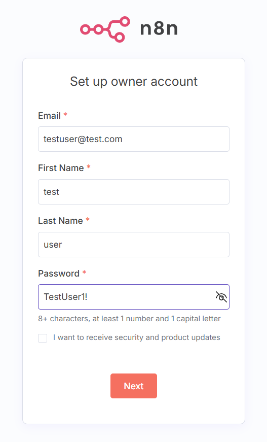

4. The dashboard will be loaded.

### Open WebUI

1. Navigate to http://localhost:3000. The Sign In page will appear:

   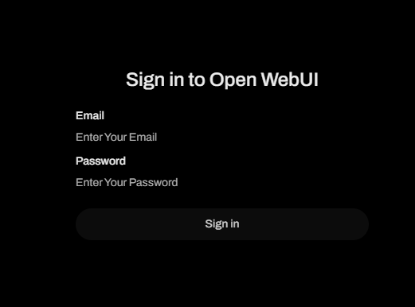

2. Use the following credentials to sign in:

   Email: admin@test.com

   Password: S2yjzup!3

3. After login, the chat interface is visible.

**Disclaimer:** Open WebUI is still under active development and is intended for experimentation and testing only. It is not recommended for production use. You may occasionally experience display delays within the Open WebUI interface. In this case, reloading the page or waiting a few seconds will usually solve the problem.

---

### 1. Start with the SDLC Supervisor

The easiest entry point is the **SDLC Supervisor** — the top-level model in Open WebUI. Simply describe what you want to do and the Supervisor will route your request to the right phase agent automatically.

In Open WebUI, select the **SDLC Supervisor** from the model picker:


Then describe your task in natural language — for example:

```
I need to write user stories for a new checkout feature.
```

The Supervisor identifies this as a Phase 1.3 Requirements Engineering task, routes to the `requirements-engineer` plugin, and returns structured user stories — without you having to know which agent or skill handles this.

---

### 2. Work with a specific Phase Orchestrator

If you already know which phase you're working in, select the corresponding model directly in Open WebUI. Each SDLC phase is available as its own model:


For example, selecting **SDLC Phase 3.1 Development** gives you direct access to the `code-companion` plugin. The Phase Orchestrator will ask clarifying questions, then delegate to the appropriate agent within that phase.

---

### 3. Call a Skill directly

For precise, single-purpose tasks, use Skills as slash commands in Claude Code — no orchestrator overhead, no dialogue:

```
/fix-bug
/generate-test-suite
/changelog
/anomaly-detection
```

Skills are atomic: they take a defined input, execute exactly one thing, and return a defined output. All 180 skills are available as slash commands.

---

### 4. Explore the n8n Workflows

Each Phase Orchestrator is a dedicated n8n workflow. Open n8n at http://localhost:5678 to inspect, customize, or extend any of the 21 workflows:

- **SDLC-Supervisor** — the master routing workflow
- **Phase Orchestrator Agents** — one workflow per SDLC phase (19 total)
- **Load-Skill** — a utility workflow for dynamic skill loading

Each Orchestrator Agent workflow follows the same pattern:

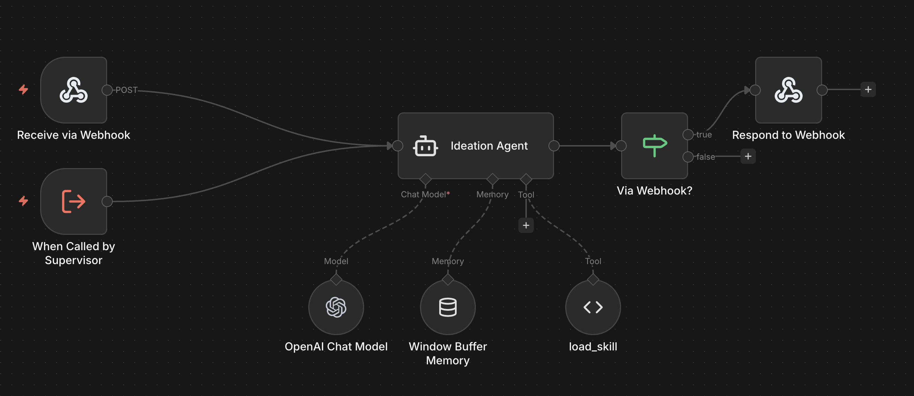

- **Trigger via Webhook** — called directly from Open WebUI
- **Trigger from Supervisor** — called internally by the SDLC Supervisor
- **Agent node** — connected to a language model, conversation memory, and the `load_skill` tool
- **Response via Webhook** — returns the result to Open WebUI

---

### 5. Setting up Jira

1. Navigate to http://localhost:8080
2. The Jira setup page will appear.
3. Select Database Type PostgreSQL and fill in the required fields. Default values are provided in the `.env` file.

   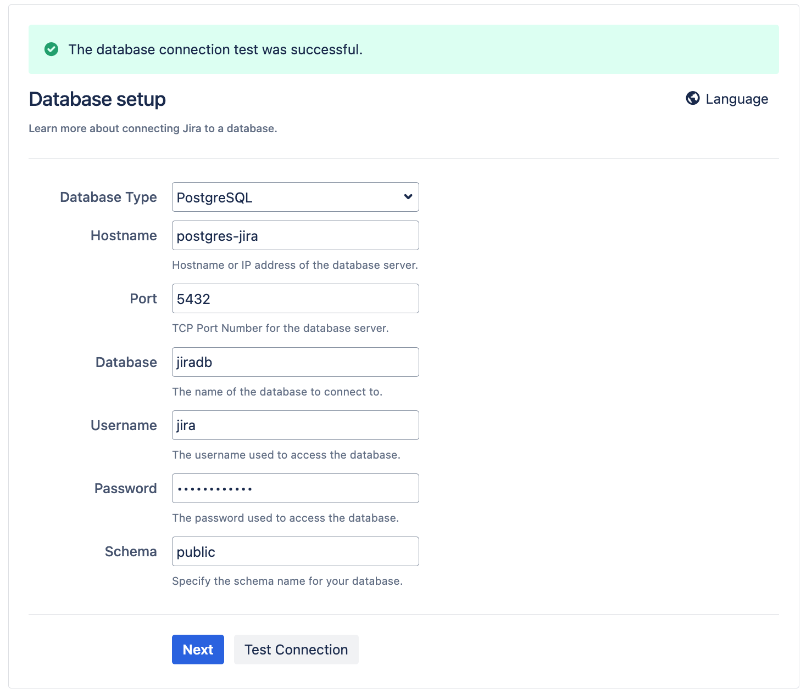

4. The application properties can be adopted by default.

   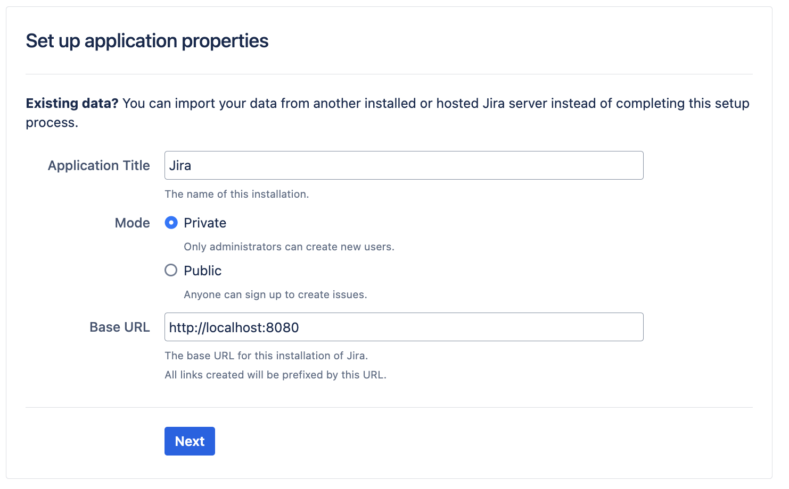

5. Generate a Server ID and link it to a Jira license. If no license is available, click "Generate a new trial license" for Jira Software (Data Center).

   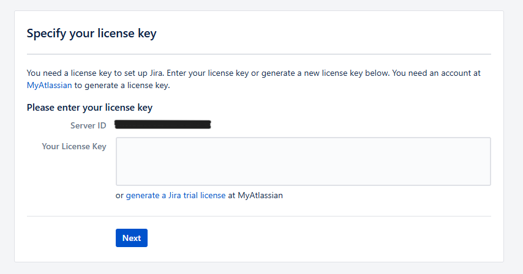

6. Configure issue types: Click on Settings → Issues and add "Story" and "Bug" as issue types.

   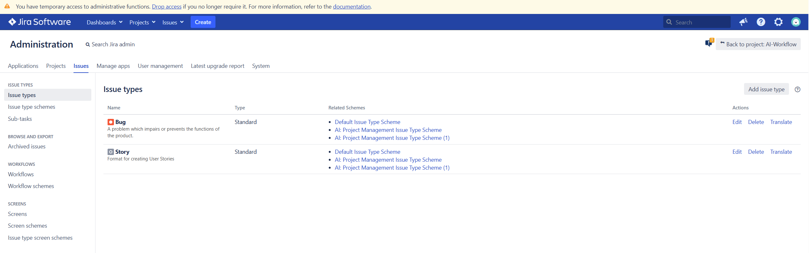

7. Adapt the `.env` file with your Jira connection details.

#### Create and configure personal access tokens

1. Log in and open Settings.
2. Select Personal Access Tokens in the left sidebar.
3. Click "Create new token".
4. Copy the generated token and paste it into the `.env` file:

   ```
   JIRA_PERSONAL_TOKEN=your_token
   JIRA_USERNAME=your_username
   JIRA_PROJECT=project_key
   ```

---

## 💡 Notes

### Model Configuration

The Llama 3.2 model is installed by default. You can easily configure different models using environment variables.

#### Quick Start: Change the Primary Model

1. Edit the `.env` file:

   ```bash
   OLLAMA_MODEL=mixtral
   ```

2. Restart the containers:
   ```bash
   docker compose down
   docker compose --profile gpu-nvidia up  # or your profile
   ```

#### Using Multiple Models

To pull multiple models on startup for different workflows:

1. Edit the `.env` file:
   ```bash
   OLLAMA_MODEL=llama3.2
   OLLAMA_ADDITIONAL_MODELS=mixtral,codellama,phi3  # comma-separated
   ```

Note: For `OLLAMA_MODEL` and `OLLAMA_ADDITIONAL_MODELS` double check which
version of Ollama is required to run them. It might be they are available only
in pre-release versions, which are not tagged as `:latest` in Docker Hub and thus pulling them might fail. Identify the running version with `docker exec -it ollama ollama -v`

2. Restart as above

Available models: [Ollama Library](https://ollama.com/library)

**Note**: Model changes in n8n workflows must be done manually via the n8n UI:

1. Open the workflow in n8n
2. Click on the "Ollama Chat Model" node
3. Change the model field (e.g., from "llama3.2:latest" to "mixtral:latest")
4. Save the workflow

---

## 🔗 OpenWebUI and n8n Integration Architecture

### Platform Architecture

The platform leverages containerization technology, where each component runs in its own container connected through a shared virtual network. This architecture provides:

- Hardware independence and platform portability
- Low entry barrier for new users
- Simplified deployment with minimal setup steps

### How the Integration Works

#### Communication Flow

1. **User Input**: Users interact with the platform through Open WebUI's chat interface, selecting a phase model or the SDLC Supervisor and submitting a request.

2. **PIPE Function**: Each Open WebUI model is backed by a custom Python PIPE function that bridges communication with n8n:
   - Intercepts user messages instead of sending them directly to an AI model
   - Forwards requests to the corresponding n8n workflow via webhook
   - Maintains session management for continuous conversations

   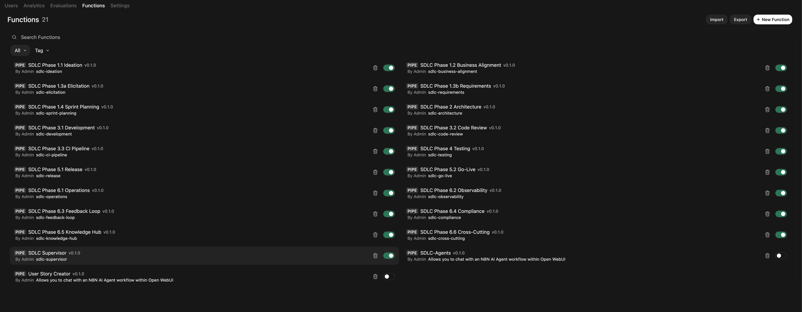

3. **Webhook Trigger**: n8n receives the message through a webhook endpoint, triggering the appropriate Orchestrator Agent workflow.

4. **Agent Processing**: Within n8n, the Orchestrator Agent:
   - Uses a language model for reasoning and dialogue
   - Maintains conversation context via Window Buffer Memory
   - Dynamically loads Claude Code skill definitions via the `load_skill` tool
   - Calls MCP connectors to interact with external systems (Jira, GitHub, SonarQube, etc.)

5. **Response Delivery**: The generated response is sent back to Open WebUI via webhook, where it's rendered with markdown formatting, code syntax highlighting, and structured display.

### The n8n-Pipe Function

The n8n-pipe is a Python function that bridges Open WebUI with n8n workflows. Key features include:

- **Webhook Configuration**: Configurable n8n webhook URL and bearer token authentication
- **Field Mapping**: Customizable input and output field names for data exchange
- **Status Indicators**: Real-time status emissions to show workflow progress
- **Session Management**: Maintains session IDs for conversation continuity
- **Error Handling**: Comprehensive error catching and reporting

### Integration with External Systems

The platform extends your existing enterprise toolchain rather than replacing it. Through n8n's node library and MCP support, agents can:

- Read and push data to Jira, Confluence, and GitHub
- Trigger CI/CD pipelines and quality gates
- Query monitoring systems and alert on SLO breaches
- Post updates to Slack and coordinate via PagerDuty

---

## 🤖 Chat-based Workflow Creation with n8n-MCP

Agent Garage becomes even more powerful with the n8n-MCP (Model Context Protocol) Server! This enables you to create n8n workflows directly through chat interactions in AI development environments like Claude, Windsurf, or Cursor - without having to dig through the complete n8n documentation.

### What is n8n-MCP?

The n8n-MCP Server gives AI assistants comprehensive access to n8n node documentation and enables:

- Chat-based workflow creation without deep n8n knowledge
- Smart node search and suggestions
- Validation of node configurations before deployment
- Access to more than 500 n8n nodes with extensive property coverage

### Quick Start

1. **Installation via npx (recommended):**

   ```bash
   npx n8n-mcp
   ```

2. **Configure in your AI development environment:**
   - Add the MCP server to your Claude/Cursor/Windsurf configuration
   - Start a new chat and describe your desired workflow

3. **Create workflows:**
   Simply describe in chat what you want to automate:
   ```
   "Create a workflow that daily fetches emails from Gmail,
   saves attachments to Google Drive, and sends a Slack notification"
   ```

### Benefits for Agent Garage Users

- **No n8n expertise required:** The AI assistant translates your requirements into working workflows
- **Faster development:** From idea to workflow in minutes instead of hours
- **Error reduction:** Automatic validation of node configurations

For more details and complete documentation, visit the [n8n-MCP Repository](https://github.com/czlonkowski/n8n-mcp).

---

## Upgrading

### For Nvidia GPU Setups

```bash
docker compose --profile gpu-nvidia pull
docker compose create && docker compose --profile gpu-nvidia up
```

### For Mac / Apple Silicon Users

```
docker compose pull
docker compose create && docker compose up
```

### For Non-GPU Setups (CPU Only)

```bash
docker compose --profile cpu pull
docker compose create && docker compose --profile cpu up
```

---

## 👓 Recommended Reading

n8n is full of useful content for getting started quickly with its AI concepts and nodes.

- [AI agents for developers: from theory to practice with n8n](https://blog.n8n.io/ai-agents/)
- [Tutorial: Build an AI workflow in n8n](https://docs.n8n.io/advanced-ai/intro-tutorial/)
- [Langchain Concepts in n8n](https://docs.n8n.io/advanced-ai/langchain/langchain-n8n/)
- [Demonstration of key differences between agents and chains](https://docs.n8n.io/advanced-ai/examples/agent-chain-comparison/)
- [What are vector databases?](https://docs.n8n.io/advanced-ai/examples/understand-vector-databases/)

---

## 🎥 Video Walkthrough

- [Installing and using Local AI for n8n](https://www.youtube.com/watch?v=xz_X2N-hPg0)

---

## 🛍️ More AI Templates

For more AI workflow ideas, visit the [**official n8n AI template
gallery**](https://n8n.io/workflows/?categories=AI). From each workflow,
select the **Use workflow** button to automatically import the workflow into
your local n8n instance.

### Learn AI Key Concepts

- [AI Agent Chat](https://n8n.io/workflows/1954-ai-agent-chat/)
- [AI chat with any data source (using the n8n workflow too)](https://n8n.io/workflows/2026-ai-chat-with-any-data-source-using-the-n8n-workflow-tool/)
- [Chat with OpenAI Assistant (by adding a memory)](https://n8n.io/workflows/2098-chat-with-openai-assistant-by-adding-a-memory/)
- [Use an open-source LLM (via Hugging Face)](https://n8n.io/workflows/1980-use-an-open-source-llm-via-huggingface/)
- [Chat with PDF docs using AI (quoting sources)](https://n8n.io/workflows/2165-chat-with-pdf-docs-using-ai-quoting-sources/)
- [AI agent that can scrape webpages](https://n8n.io/workflows/2006-ai-agent-that-can-scrape-webpages/)

### Local AI Templates

- [Tax Code Assistant](https://n8n.io/workflows/2341-build-a-tax-code-assistant-with-qdrant-mistralai-and-openai/)
- [Breakdown Documents into Study Notes with MistralAI and Qdrant](https://n8n.io/workflows/2339-breakdown-documents-into-study-notes-using-templating-mistralai-and-qdrant/)
- [Financial Documents Assistant using Qdrant and](https://n8n.io/workflows/2335-build-a-financial-documents-assistant-using-qdrant-and-mistralai/) [Mistral.ai](http://mistral.ai/)
- [Recipe Recommendations with Qdrant and Mistral](https://n8n.io/workflows/2333-recipe-recommendations-with-qdrant-and-mistral/)

---

## 💡 Tips & Tricks

### Accessing Local Files

Agent Garage will create a shared folder (by default, located in the same directory) which is mounted to the n8n container and allows n8n to access files on disk. This folder within the n8n container is
located at `/data/shared` -- this is the path you'll need to use in nodes that
interact with the local filesystem.

**Nodes that interact with the local filesystem:**

- [Read/Write Files from Disk](https://docs.n8n.io/integrations/builtin/core-nodes/n8n-nodes-base.filesreadwrite/)
- [Local File Trigger](https://docs.n8n.io/integrations/builtin/core-nodes/n8n-nodes-base.localfiletrigger/)
- [Execute Command](https://docs.n8n.io/integrations/builtin/core-nodes/n8n-nodes-base.executecommand/)

> [!NOTE]
> This starter kit is designed to help you get started with self-hosted AI
> workflows. While it's not fully optimized for production environments, it
> combines robust components that work well together for proof-of-concept
> projects. You can customize it to meet your specific needs

---

## 📜 License

This project is [licensed under the Apache 2.0 license](LICENSE).
